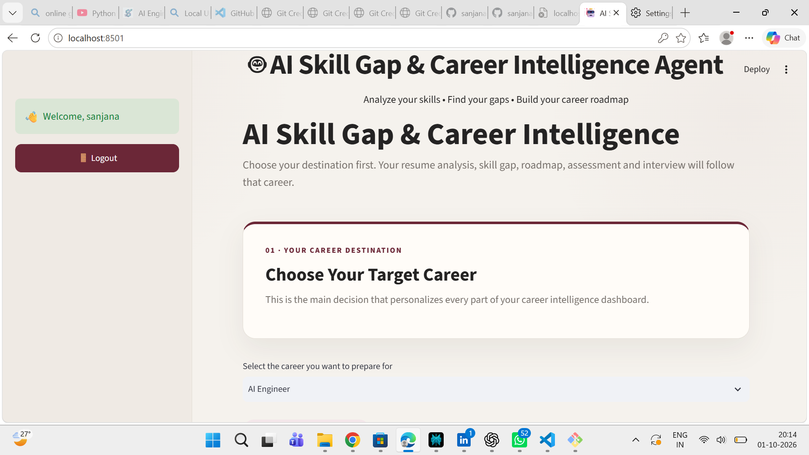
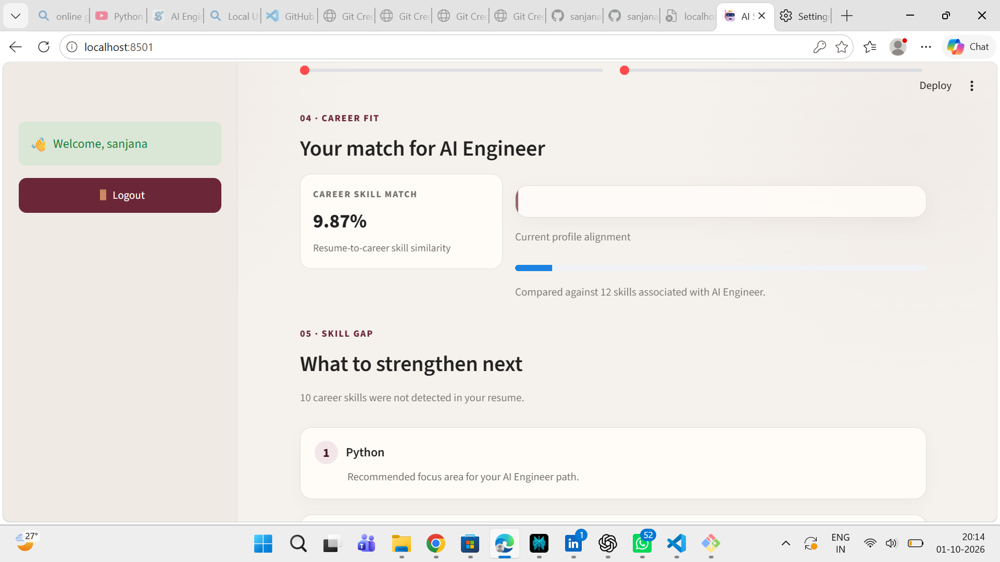
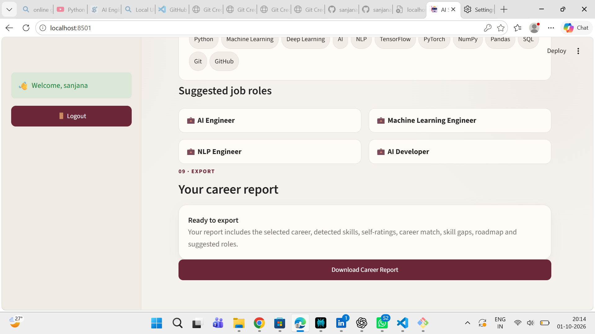

\# AI Skill Gap \& Career Intelligence Agent


An AI-powered Streamlit application that analyzes resumes, identifies skills, compares them with a target career, detects skill gaps, and generates a personalized career roadmap.


\## 🚀 Features


\- 🔐 User login and signup

\- 🎯 Target career selection

\- 📄 Resume upload and text extraction

\- 🧠 Automatic skill detection

\- 📊 Career match analysis


## 📸 Screenshots

### 🏠 Home


### 📊 Skill Gap Analysis


### 📄 Career Report

\- 🔎 Skill gap identification

\- 🗺️ Personalized learning roadmap

\- 📝 Resume-based assessment

\- 🎤 Resume-based mock interview

\- 📈 Career intelligence insights

\- 📑 Career report generation


\## 🔄 Application Workflow


```text

Choose Career

&#x20;     ↓

Upload Resume

&#x20;     ↓

Resume Analysis

&#x20;     ↓

Detected Skills

&#x20;     ↓

Career Match

&#x20;     ↓

Skill Gap Analysis

&#x20;     ↓

Personalized Roadmap

&#x20;     ↓

Optional Assessment / Mock Interview

&#x20;     ↓

Career Report


## 🚀 Live Demo

[Open the AI Skill Gap & Career Intelligence Agent](https://ai-skill-gap-career-agent-sanjana.streamlit.app)

## 🎥 Demo Video

[Watch the project demo video](./Video%20Project.mp4)

